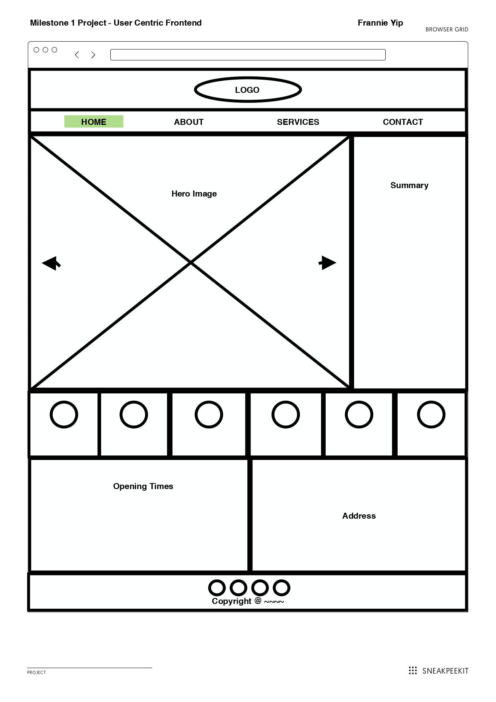
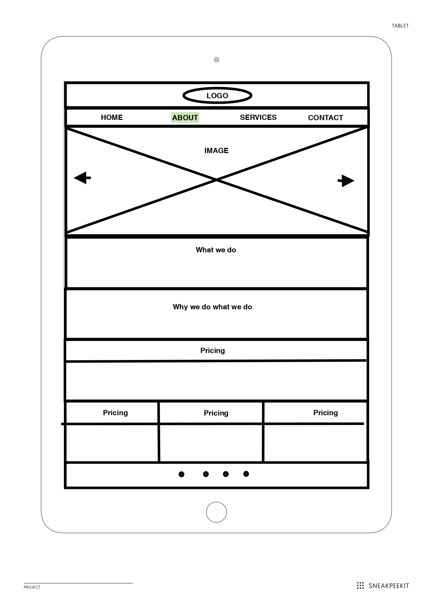
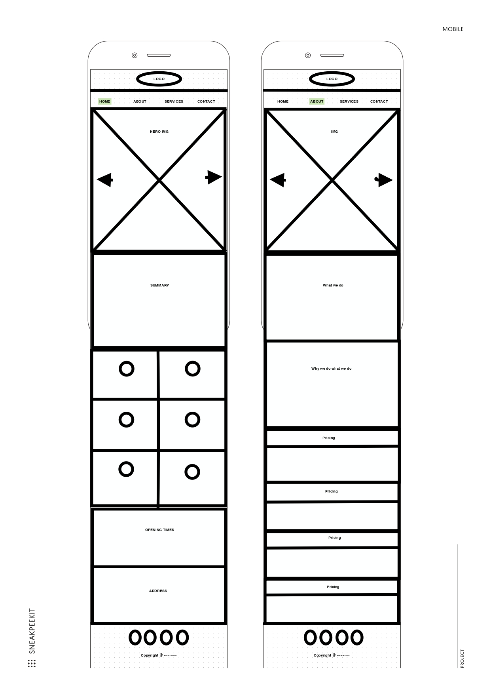
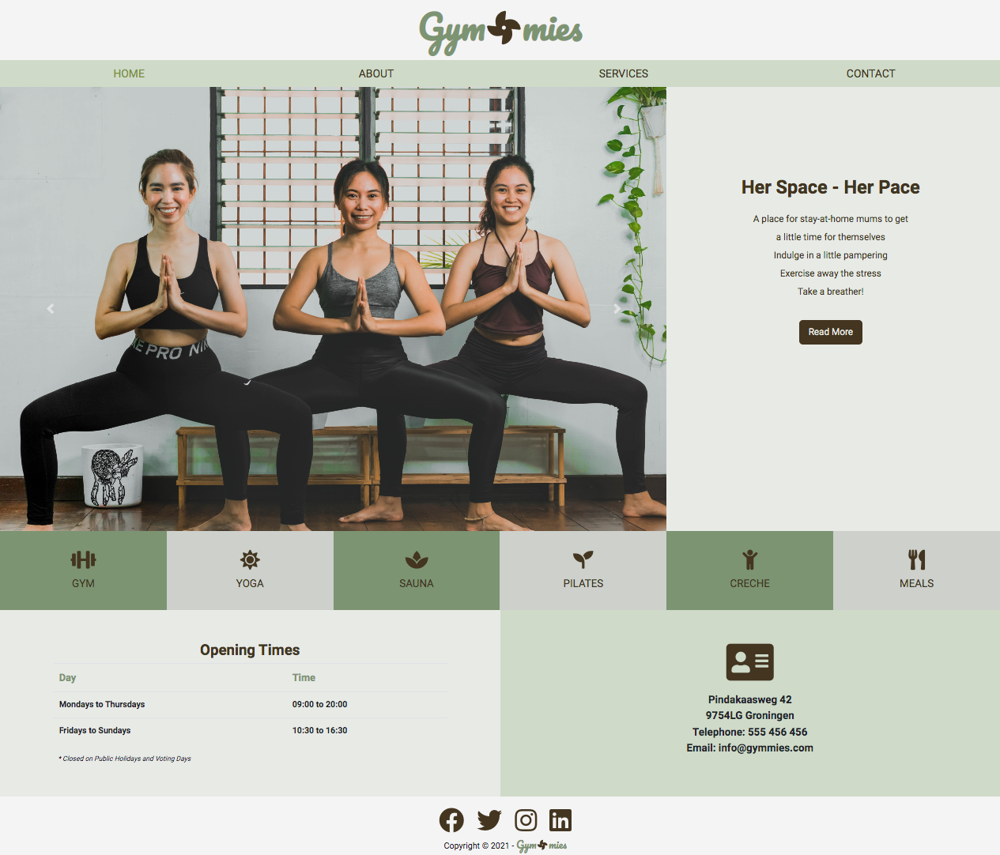
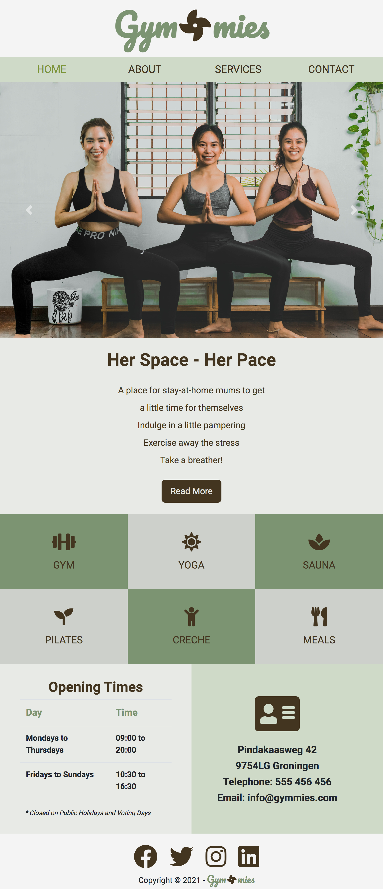
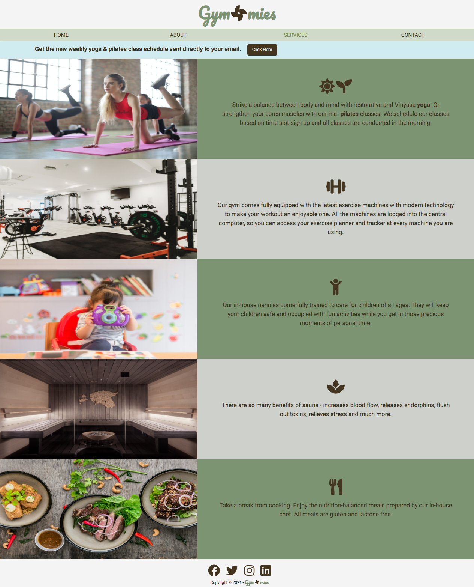
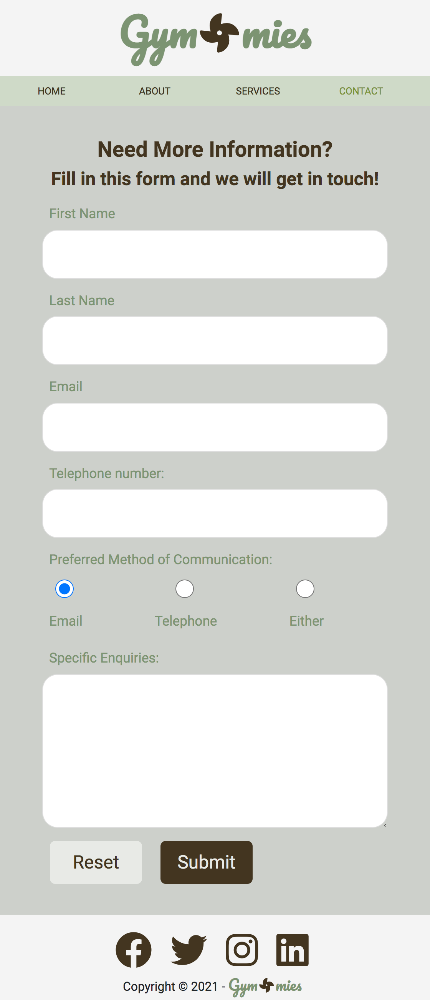

MILESTONE PROJECT ONE - USER CENTRIC FRONTEND DEVELOPMENT 
# Gym|mies A gym for the stay-at-home mums
This project features a website of a gym that caters towards stay-at-home mothers. 
The website is designed to be simple to use, easy on the eyes and sufficiently informative at first glance.
The user will be able to scroll through a image carousel, request a schedule to be sent via email through a modal pop-up form
and asked to be contacted through a contact form. 

## This project can be viewed here : [Gym|mies](https://finnsterfran.github.io/Gymmies-Milestone-1-Project---Frannie-Yip/index.html)

# UX
## User stories
### Visitor to the website 
* I want to have a visual idea of what to expect at this gym, so images would be nice. 
* I don't want too much text to scroll through to read, as a busy mother I don't have all day to read.
* I want to be able to easily access information that I need with as little clicking as possible.
* I want to know what kind of services to expect, and what kind of packages and prices there are.
* I want to be able contact someone for information. 

### Business developer for website 
* I want to give users a visually comfortable experience on the website, calm colours and simple layout.
* I want users to be able to find the information they need quickly, so easy navigation is important.
* I want to simplify the pricing choices the user will have to make when choosing to sign up.
* I want users to return to the website regularly.

## 1. Strategy 
* The target users to this website are stay-at-home mothers, it has to be simple and not time consuming to navigate.
* This website needs to appeal to them visually, psychologically and emotionally.
* The homepage should already provide, at first glance, all the vital information about the business. It should answer questions like:
    * Does this have all the services I need? 
    * What are the opening times?
    * Where is it located?
    * Where can I find further information?
    * Are there any upcoming events? (provided in carousel)
* Provide one feature that would require the user to return to the website on a regular basis.

## 2. Scope 
* A carousel slide and multiple images to provide visual representation of the business that the website features.
* Easy to navigate within the website.
* A visual outline of the services provided on the landing page.
* Provide a reason to return to the website - requesting updated schedule. 
* Allow the user to request for contact and choose the method of how they wish to be contacted.

## 3. Structure 
* The consistent features throughout all pages on the websites are:
    * Logo at the top 
    * Website navigation bar just under the Logo
    * Social navigation icons at the footer
* The homepage provides an impression, the images in the carousel and the boxes with icons of the services provided will give the users a good idea of what to expect.
* The about page will provide simple information outlining what the business is about, what kind of package is offered and the kind of pricing that is available.

## 4. Skeleton 
* Logo - Clickable link that brings user back to homepage.
* Navigation bar :
    * Home - returns user to homepage 
    * About - information about the business, package details and pricing
    * Services - alert with button that opens up a modal form for users to fill in name and email address. Images and descriptive text about the different services available.
    * Contact - A form for users to fill in to request for communication.
* Footer :
    * Facebook icon - clickable link that brings user to Facebook.
    * Twitter icon - clickable link that brings user to Twitter.
    * Instagram icon - clickable link that brings user to Instagram.
    * Linkedin icon - clickable link to bring use to Linkedin. 
  
* Wireframes :

### Wireframes - Desktop

#### Note : I added an alert bar just below the navigation bar with a button that opens up a modal form for user to request for a schedule to be emailed.

### Wireframes - Tablet (max-width: 748px)

#### Note : I added an alert bar just below the navigation bar with a button that opens up a modal form for user to request for a schedule to be emailed.

### Wireframes - Mobile (max-width: 520px)

## 5. Surface 
### Colors :
The color palette I choose comes from [Colorhunt](https://colorhunt.co/) 
I choose this color palette for its naturally and calming feel, and it doesn't distract from the content of the website.

### Typography :
"Pacifico" font family used mainly for the logo but also appears twice in About for content titles.
"Roboto" font family is primary for the entire body of the website.

# Features 
## Existing Features 
* Responsive navigation bar 
* Carousel slider for images
* Read More button navigates to the about page 
* Alert bar button opens up a modal form for inputting name and email for submission to request yoga/pilates class schedules to be emailed to user
* Submittable form in contact page 

## Features to consider implementing in the future 
* A shout-out for upcoming events on homepage
* A map to show where the location of the gym
* A login for users to sign up for classes online

# Technologies Used 
## Languages
* HTML5
* CSS3 
* Bootstrap 4.5

## Integrations 
* [Google Fonts](https://fonts.google.com/) - Typography
* [Font Awesome](https://fontawesome.com/) - Icons 
* [Bootstrap](https://getbootstrap.com/) - Framework

## Workspace, Version Control and Repository Storage 
* [Gitpod]() 
* [Github]()
* [Git]()

# Resources 
* [Bootstrap Docs](https://getbootstrap.com/)
    * for carousel, alert & modal 
* [Github Guides](https://guides.github.com/features/mastering-markdown/)
    * for Markdown language reference
* [Sneakpeekit](https://sneakpeekit.com/)
    * printable grids which I used for my wireframes and edited using preview
* [Unsplash](https://unsplash.com/)
    * all the images that I have used on this project 
    
# Responsiveness 

## HOME-PAGE 
#### Laptop - max-width: 1048px

#### Tablet - max-width: 748px 

#### Mobile - max-width: 560px

## ABOUT-PAGE
#### Laptop - max-width: 1048px

#### Tablet - max-width: 748px 

#### Mobile - max-width: 560px

## SERVICES-PAGE

#### Laptop - max-width: 1048px

#### Tablet - max-width: 748px 

#### Mobile - max-width: 560px

## CONTACT-PAGE

#### Laptop - max-width: 1048px

#### Tablet - max-width: 748px 

#### Mobile - max-width: 560px

# Testing
1. I ran the individual HTML pages through [W3 Validator](https://validator.w3.org/) 

#### Home-page -  2 errors.
* a element cannot be direct child of button  
    * I fixed this by removing the button element altogether and just inserting the pre-defined class of "mainbutton"
        * < a  >href="about.html" class="mainbutton">Read More < /a >
* thead is within table body 
    * I fixed this by adding in the missing elements < tr > below < thead > and changing < td >
to < th > instead.
#### About-page - multiple warnings
* error/warning for 'bogus comments', I had added one hyphen too many to the end of the comments.
    * fixed this by removing all the extra hyphen

#### Services-page 
* only returned one error/warning, again 'bogus comment'.

#### Contact-page 
* returned one error to the form element, action was empty.
    * fixed issue by adding a "#' to action.

2. I ran the codes in [Closing Tag Checker](https://www.aliciaramirez.com/closing-tags-checker/) 
* All results = No unclosed tags.

3. I ran style.css in [W3C Css Validator](https://jigsaw.w3.org/css-validator/validator)
* It returned with no errors.

# Version Control and Deployment
#### Commit 1 - Initial Commit 
Created the foundation of the website: 
* asset folder containing css and images sub-folders
* index.html, about.html, services.html, contact.html, style.css.
* header, navigation bar and footer html & CSS template created and applied to each .html page.  

#### Commit 2 - Added to hero section, features and information sessions
* implemented a carousel to showcase 6 photographs, with user control scrolling.
* added the summary session to the right of the carousel. 
* added the features section which consist of 6 boxes sitting side by side horizontally.
* added opening times and information section.

#### Commit 3 - Added a modal to service.html, images and text boxes.
* worked on including an alert bar with a button that opens a modal form in service.html
* added images and text boxes. 
* added css styling for services.html

#### Commit 4 - Added form to contact.html
* added form using bootstrap form
* adde css styling for form
* made minor changes to hero section in index.html

#### Commit 5 - Completed about.html.
* added main image for page
* double boxes for about information
* bootstrap cards for the pricing boxes
* added css styling for page

#### Commit 6 - Restructured contact.html added media query (max-width: 1024px)
* contact.html was not lining up properly, I redid the container without bootstrap so that it would line up properly,
* begin on media query for laptop viewport

#### Commit 7 - Finished all other viewport mediaquery
* meqia queries for the other viewports

#### Commit 8 embedded img index.html and about.html for accessibility, fixed social links
* removed the hero images from style.css and embedded them directly into index.html
* added alt text to the images for accessibility
* fixed social media links at footer. Linked were not full url address so they did not link properly.

#### Deployment 
In Github, I took these steps to deploy my website:
* in the 'Repository', clicked on this project 
* went into 'Settings' and scrolled down to 'Github pages'
* under 'Source', selected 'branch: 'main'', 'root', 'save'

#### Commit 9
* fixed path to include . in front because the images would not load on webpage

#### Commit 9 fixed images and boxes in services.html
* removed images from style.css for services.html and embedded them directly in html for accessibility.
* changed the layout of the boxes and image. 

#### Commit 10, 11, 12, 13 Changes to css.html for Responsiveness
* made some adjustments to media query 
* added container for contact form because it was not resizing properly in mobile viewport

#### Commit 14 minor change to contact.html screenshots added to readme.md
* fixed some sizing issues with contact.html's form
* added screenshots to readme.md

#### Commit 15 more screenshots, documention, fixed testing errors
* added more screenshots
* added documentation to readme.md
* fixed testing errors

# Credit
* Thanks to my mentor Excellence Ilesanmi for his patient guidance and letting me pick his brain for ideas.
* Thanks to Henrique Peperoni whose meticulously written Readme document was the format I based my own Readme document on.
* Thanks to the Code Institute's Slack Community for helping me with a github filepath issue.

